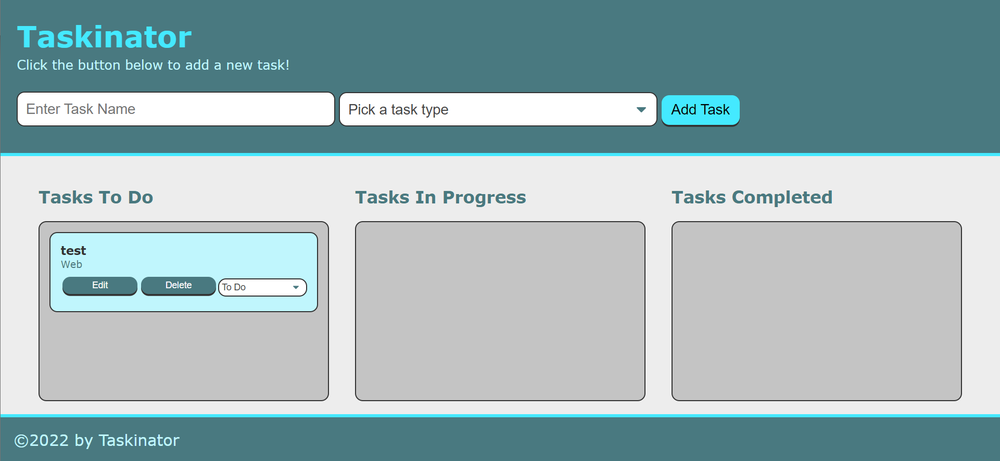

# My Portfolio

## Purpose
Creates tasks that can later be edited and deleted as well as re-categorized. Through web APIs, tasks are stored locally.

## Built With
*JavaScript (web APIs)

## Screenshot

## Website
https://vrentadax.github.io/taskinator/

## Contribution
Made with ❤️ by Dax
